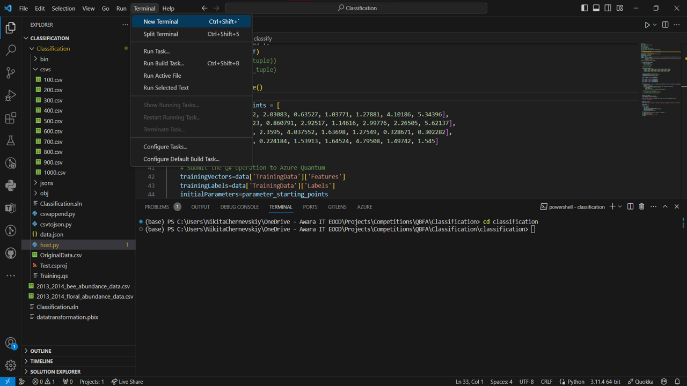
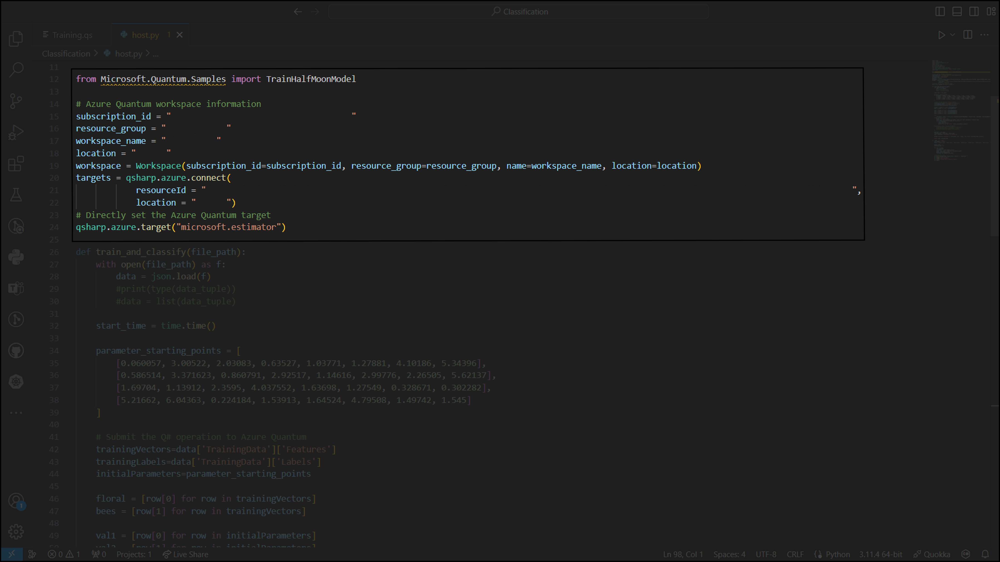
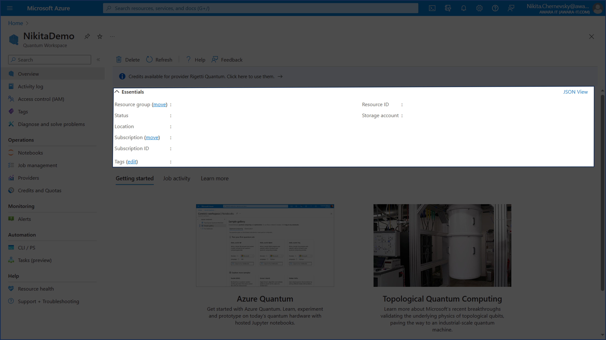

# Настройте проекта за лична разработка
1. Създайте Azure Ресурс за Квантови Сервиси Azure Quantum Workspace Resource - https://learn.microsoft.com/en-us/azure/quantum/how-to-create-workspace
2. Свалете проекта https://github.com/NikitaChernevskiy/EAQCMLP в определена локация (например C:/)
3. Свалете и инсталирайте:

   I. Visual Studio Code https://code.visualstudio.com/download

   II. Anaconda https://www.anaconda.com/download/
   
   III. Dot NET Core https://dotnet.microsoft.com/en-us/download
4. Свалете ресурси и инструменти за разработка с Квантови алгоритми - Quantum Development Kit - https://marketplace.visualstudio.com/items?itemName=quantum.qsharp-lang-vscode
5. Създайте и активирайте виртуална среда с Anaconda - https://learn.microsoft.com/en-us/azure/quantum/install-overview-qdk?tabs=tabid-vscode%2Ctabid-conda#use-q-and-python-with-jupyter-notebooks
6. Сега трябва да свалим няколко пакета. В терминала за локацията с проекта копирайте този списък с команди:
```
pip install qsharp
dotnet tool install -g Microsoft.Quantum.IQSharp
dotnet iqsharp install
pip install --upgrade azure-quantum
dotnet add package Microsoft.Quantum.MachineLearning
pip install azure-ai-ml
pip install -U pip
pip install -U matplotlib
pip install numpy 
```


7. Трябва да промените тази част от кода във файла host.py - данните може да намерите на главната страница на Azure Ресурса за Квантови Сервиси



9. За да стартирате проекта, в терминала трябва да напишете командата python host.py

# Работа с лични данни

Проектът работи с Json в специфичен формат. За да го постигнем, трябва да използваме файловете csvappend.py и csvtojson.py, а за данни - OriginalData.csv. 

OriginalData.csv е оригиналната таблица с данни, върху която работят следващите 2 питон файла. Има 6 колони - Farm, Type, Year, Round, Bees и Floral. За трениране на модела се използват колоните Bees и Floral. Колона Type определя дали фермата е полезна (HLS - 1) или вредна (ELS - 0) за пчелите. 

Csvappend.py допълва оригиналните ви данни с подобни данни с добавяне на различен шум. Така ако изначално ще имате 1 csv файл 100 реда, след изпълнението на програмата ще имате 10 файла с 100, 200, 300, 400, 500, 600, 700, 800, 900 и 1000 реда. Данните се генерират на основата на съществуващите - например една ферма има 2 години на събиране на данни и всяка година има 3 раунда на анализиране (Пролет, Лято, Есен) - така се получава, че общо 1 ферма има 6 реда на събиране на информация. Също така всяка ферма ако има някакъв тип (HLS или ELS) тогава този тип трябва да бъде един и същ за всеки ред на дадената ферма.

Csvtojson.py преобразува получените 10 csv датасета в 10 Json файла. Тези файлове служат като данни за трениране на модела. Използват се 2 колони - Bees и Floral. Структурата, в която трябва да се преобразуват съществуващите датасети изглежда така:
```
{
  "TrainingData": {
    "Features": [
      [числена стойтност 1, числена стойтност 2],
      [числена стойтност 1, числена стойтност 2]
    ],
    "Labels": [
      1,
      0
    ]
  },
  "ValidationData": {
    "Features": [
      [числена стойтност 1, числена стойтност 2]
    ],
    "Labels": [
      0
    ]
  },
}
```

При работа с лични данни тябва да помните, че може да имате повече от 2 колони данни, но моделът ще се тренира удачно САМО с 2 колони. Тоест в Json файловете не може да имате масив с 3 елемента ако желаете да получавате стабилен резултат. Също така помнете, че първия ред са заглавията на колоните, затова трябва да генерирате новите таблици с количество нужни реда + 1. Csvtojson.py специално затова подминава първия ред.
